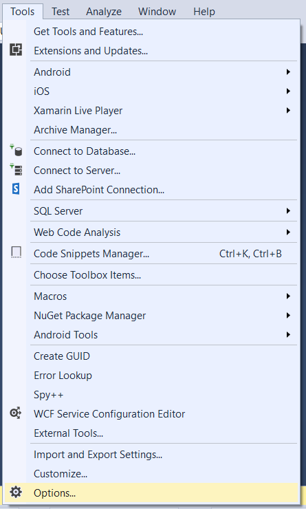

= Visual Studio Directive Macro
ifdef::env-github,env-browser[:relfileprefix: docs/]

The following is the instructions on how to set up an *automated macro for formatting using directives*.
The motivation is that this is a recurring problem that have bugged me for a while.

== 1. Get the macros plugin for visual studio

Run `VSMacros.vsix` and apply to the Visual Studio version you're using. +
Link to the original link:https://marketplace.visualstudio.com/itemsitemName=VisualStudioPlatformTeam.MacrosforVisualStudio[source]

== 2. Write a macro to reorder the directives.

Step 1. Open Visual Studio, then go to `Tools>Macros>Macro Explorer`

Step 2. Create a new macro by right-clicking the Macro Browser, then `List > New Macro`. You can name the macro whatever you want.

Step 3. Open the macro by right-clicking on its name and selecting `Open`. Copy paste the macro from the file `RemoveAndSortDirective.js`.

== 3. Adjust Visual Studio preferences for using Directives

Step 1. `Go to Tools>Options`

Step 2. Type `C#` in the search box, under C#, select `advanced`. Look for `Using Directives` section and check the following: +
* Place System directives first when sorting usings
* Separate using directive groups

When you are done, click `Ok`.

== 4. [Optional] Set up a hotkey for the macro

Step 1. Right click the macro you have just written, and select `Assign Shortcut`.

Step 2. Assign a binding to the macro. For the purpose of this tutorial, we will assign to `Ctrl+M, 1`.

Step 3. To further customize your shortcut, go to `Tools>Options`.

Step 4. Type keyboard into the search box, then select `Keyboard`. Look for `Tools.MacroCommandx`, where `x` is the number you selected in `Step 2.`

Step 5. Click in the `Press shortcut keys` box, then press a shortcut combination of your choice. When you are done, click `Ok`.

And now you are done! Run the macro whenever you need to. Just be warned that the macro is UI-based and currently loops through all files, so you might have to wait a while, or write your own macro :)
